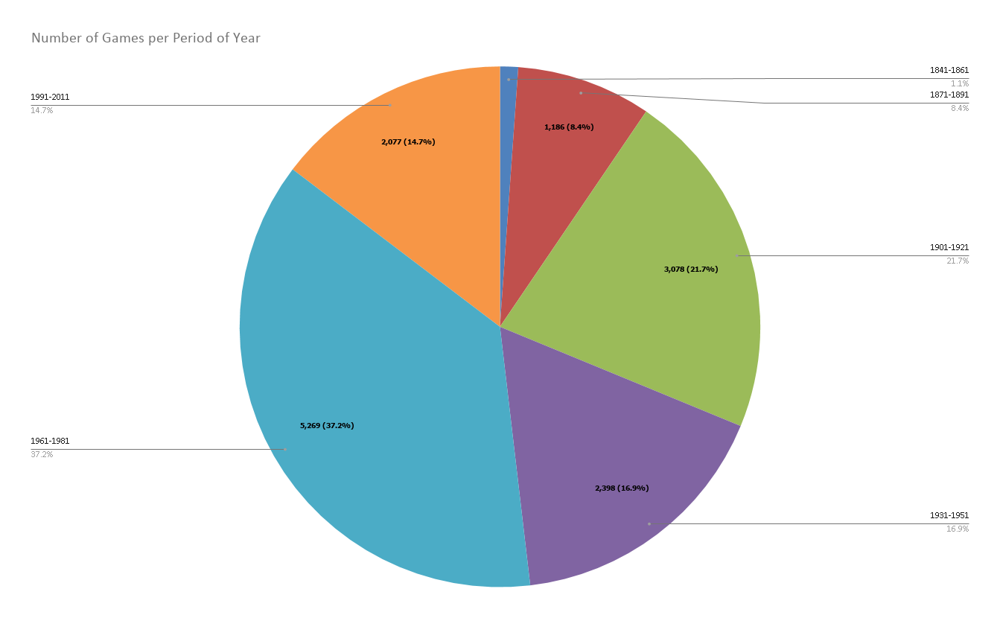
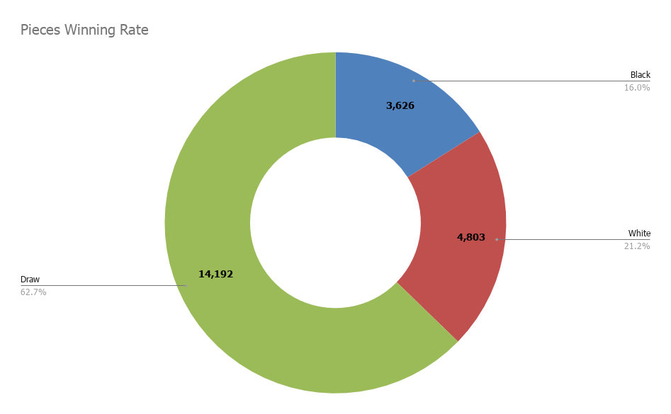
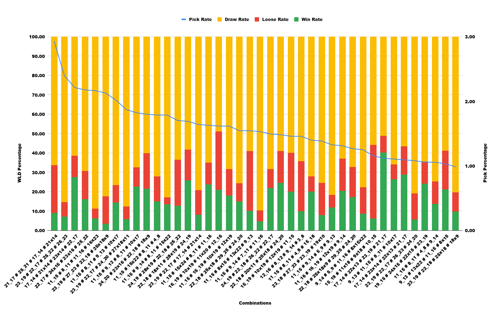
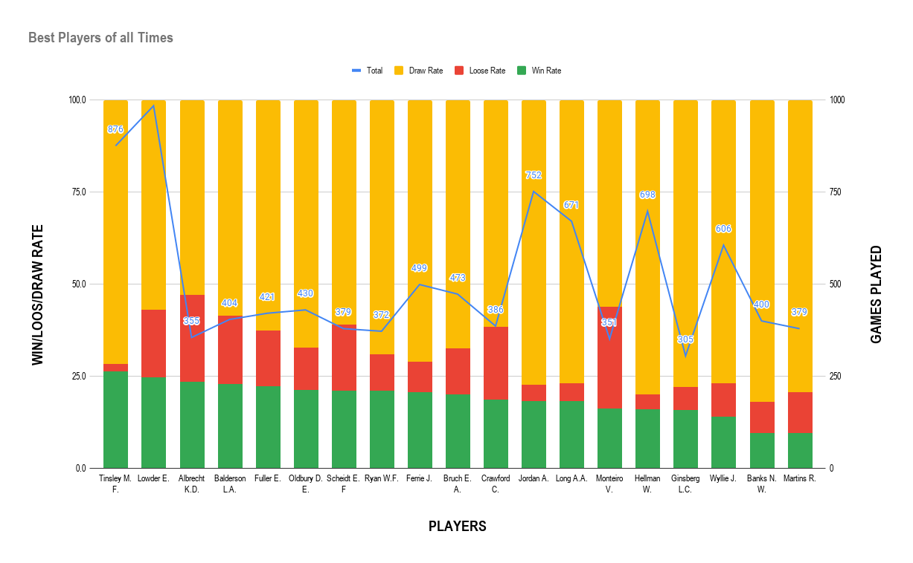

#  Analysing the trained database

In this section we will give some analysis that we did on our datasets

  - Number of Games per Period of Year
  - Pieces Winning Rate
  - Pick Rate , Winning Rate Lose Rate and Draw Rate of the first 4 Moves of the Game
  - Best players of all time

# Number of Games per Period of Year

# Pieces Winning Rate

# Pick Rate, Winning Rate, Lose Rate and Draw Rate of the first 4 Moves of the Game

# Best players of all time

  

